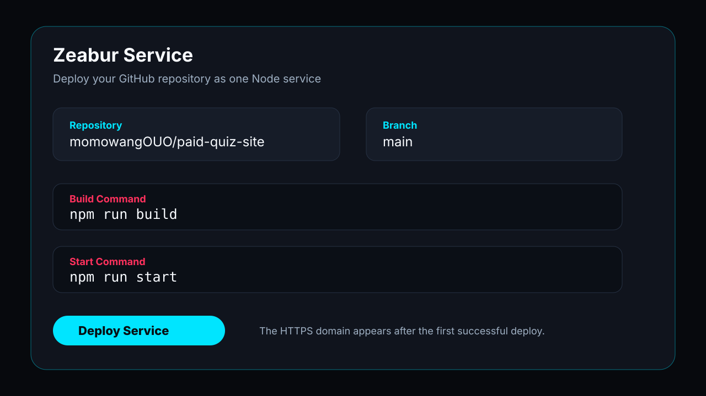
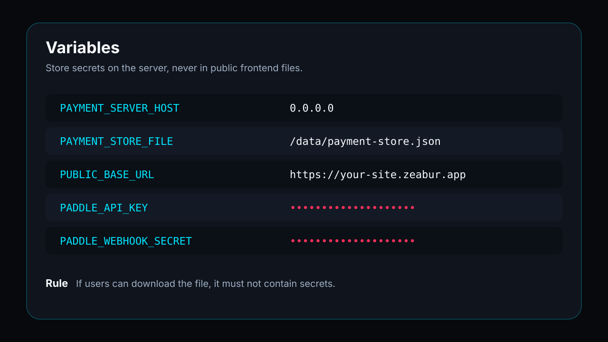
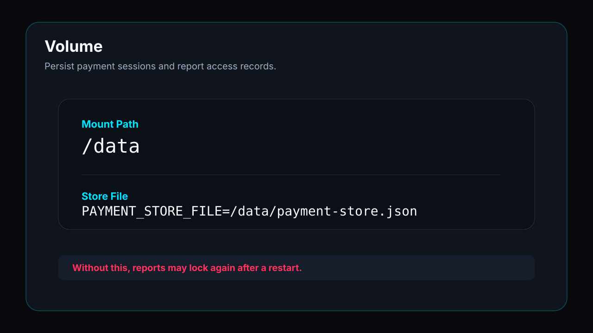
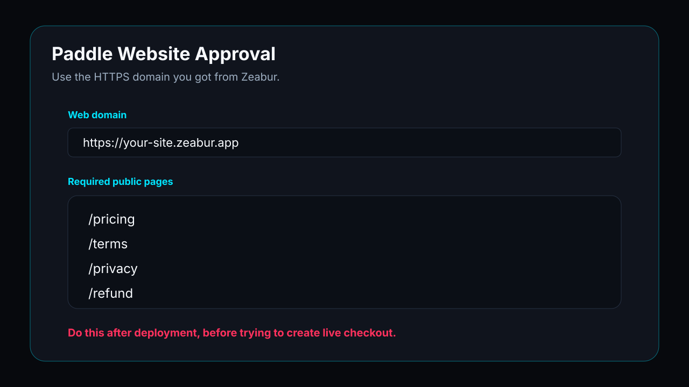
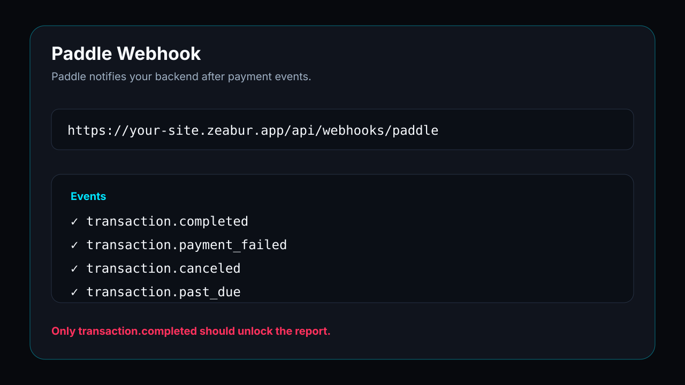

# 08. 内置界面截图图册

**【本章核心】用无隐私示意图帮助读者识别 GitHub、Zeabur 和 Paddle 配置位置。**

这一章不再要求读者自己补截图。教程已经放入一组无隐私的操作示意截图，用来降低第一次接触 Zeabur 和 Paddle 时的陌生感。

这些图不是你的真实后台截图，也不会暴露账号、订单或密钥；它们只标出你会看到的关键配置区。

> 💡 **为什么这样做？**
> 初次配置平台时，很多人不是不理解目标，而是不知道界面里该看哪里。示意图能先建立位置感，再回到文字步骤逐项操作。

## 1. GitHub 仓库准备

**【本节核心】进入 Zeabur 前，先确认 GitHub 仓库已经准备好。**

部署前先确认代码已经上传到 GitHub。

重点看四件事：

- README 是否能正常显示。
- 最新 commit 是否已经 push。
- .env 和 .local 文件是否没有出现在仓库。
- 仓库地址是否可以复制给 Zeabur。

## 2. Zeabur 服务部署

**【本节核心】确认 Zeabur 选择了正确仓库、分支和启动命令。**

把 GitHub 仓库接到 Zeabur，让平台执行 build 和 start。



重点看三件事：

- 仓库和分支是否正确。
- Build command 是否是 `npm run build`。
- Start command 是否是 `npm run start`。

## 3. Zeabur 环境变量

**【本节核心】确认变量放在 Zeabur Variables，而不是公开文件。**

环境变量只放在 Zeabur Variables，不放进前端公开文件。



上线前至少确认：

- `PUBLIC_BASE_URL` 是 HTTPS 域名。
- `PAYMENT_STORE_FILE` 指向 `/data/payment-store.json`。
- Paddle secret 不出现在 `public/monetization.json`。

## 4. Zeabur Volume

**【本节核心】确认 `/data` 用来保存订单和解锁记录。**

订单和解锁记录如果先用 JSON 文件保存，需要挂载 `/data`。



没有持久化 volume，服务重启后可能丢失付款 session。

## 5. Paddle 网站验证

**【本节核心】确认 Paddle 使用的是已经上线的 Zeabur 域名。**

Paddle 需要知道你的网站在哪里，所以 Zeabur 域名要先准备好。



常见必填项：

- Web domain。
- Pricing page。
- Terms。
- Privacy。
- Refund policy。

## 6. Paddle 产品与价格

**【本节核心】确认一次性报告使用 one-time price。**

一次性报告要建立 one-time price，不要误开 subscription。


建议先准备：

- CNY 9.90。
- USD 1.99。
- 分别复制两个 `pri_...` price id。

## 7. Paddle Webhook

**【本节核心】确认 Paddle 会把付款结果通知到你的后端。**

Webhook 是自动解锁的关键。



Webhook URL 应该是：

```text
https://你的域名/api/webhooks/paddle
```

至少启用：

- `transaction.completed`
- `transaction.payment_failed`
- `transaction.canceled`
- `transaction.past_due`

## 8. 完整顺序

**【本节核心】从 mock 到真实付款，顺序不能跳过 GitHub 和 Zeabur 域名。**

如果你只记一张图，记这张：


正确顺序是：

```text
mock 流程
  -> 上传 GitHub
  -> Zeabur 部署
  -> HTTPS 域名
  -> Paddle 网站验证
  -> Paddle checkout / webhook
  -> 真实付款测试
```

## 截图安全规则

**【本节核心】如果未来换成真实截图，必须先打码敏感资料。**

如果你之后想替换成真实后台截图，请先处理：

- 打码 API key、webhook secret、token。
- 打码邮箱、手机号、订单号、用户资料。
- 不截图真实客户数据。
- 不截图测评算法、题库、报告生成逻辑。
- 如果后台 UI 和文字步骤冲突，以文字步骤和官方文档为准。
