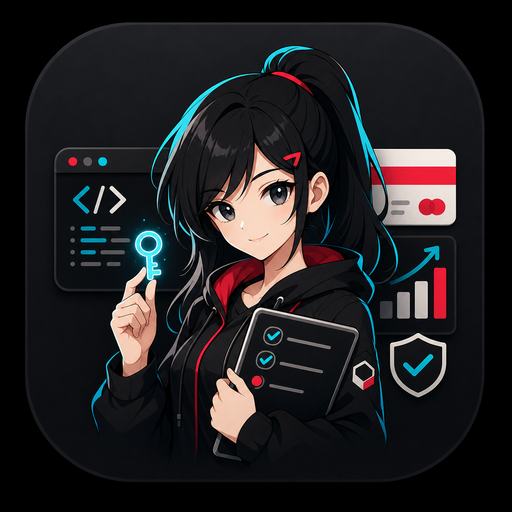

# 用 Codex 做出可收費網站

[简体中文](README.md) · **繁體中文** · [English](README.en.md) · [日本語](README.ja.md) · [한국어](README.ko.md)

  

> 從 0 到上線：測驗產品、GitHub、Zeabur、Paddle 與自動解鎖。

- 這份教學不講空泛概念，而是帶你做出一個真的能收款、能自動解鎖內容的網站。
- 順序很重要：先做可運作網站，再部署到 Zeabur 拿到 HTTPS 網域，最後再去 Paddle 申請網站驗證與付款。
- 如果你是 0 基礎，就照著章節走，把每一步交給 Codex 拆任務、改程式、檢查結果。

## 教學目錄

1. [產品與流程設計](docs/zh-TW/01-product-flow.md)
2. [用 Codex 做出網站](docs/zh-TW/02-codex-build-workflow.md)
3. [上傳到 GitHub](docs/zh-TW/03-upload-to-github.md)
4. [部署到 Zeabur](docs/zh-TW/04-zeabur-deployment.md)
5. [串接 Paddle 收費](docs/zh-TW/05-payment-unlock.md)
6. [提示詞範本](docs/zh-TW/06-prompt-templates.md)
7. [上線檢查清單](docs/zh-TW/07-launch-checklist.md)

## 你會做出什麼

- 先做出可體驗的免費測驗與結果頁。
- 用後端儲存訂單狀態，避免靠 URL 參數假解鎖。
- 把網站部署到 Zeabur，取得 Paddle 可驗證的 HTTPS 網域。
- 用 Paddle Checkout 與 webhook 完成付款後自動解鎖。
- 用檢查清單確認上線前不會外洩 secret。

## 相關連結

- [示範網站：The Calling Deconstructor](https://callingdeconstructor.zeabur.app/)
- [靜態教學網站](https://momowangouo.github.io/codex-paid-quiz-tutorial/)
- [GitHub 倉庫](https://github.com/momowangOUO/codex-paid-quiz-tutorial)
- [合作表單](https://docs.google.com/forms/d/e/1FAIpQLSet3g2cL32ZElYICNwvxaq27R0pxqyoHw2AK5bQHjDzNQwlUg/viewform)

如果示範網站偶爾睡著，通常只是小型伺服器預算在休息；教學本身仍然可以照做。
