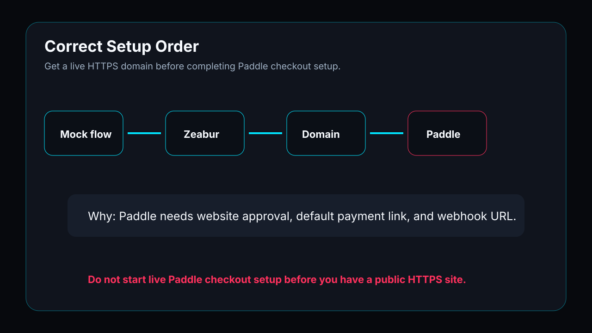
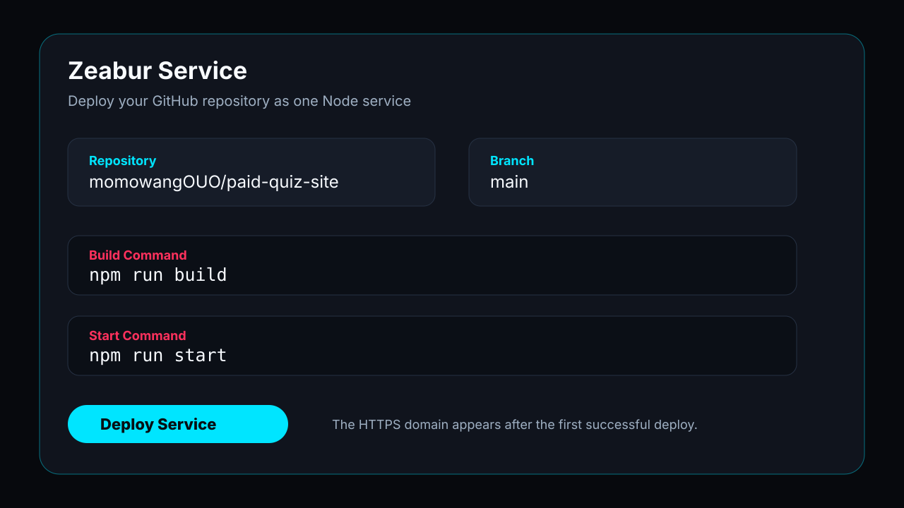
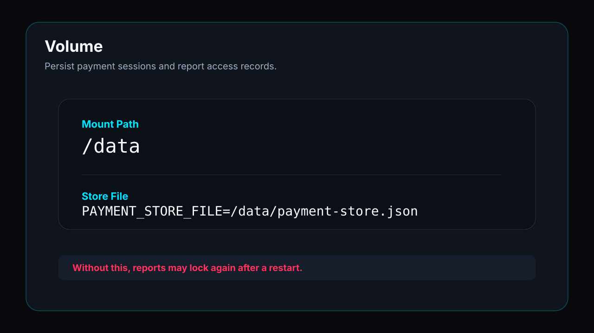

# 04. 먼저 Zeabur 에 배포하기

**목표: Paddle 설정 전에 공개 HTTPS 도메인을 얻습니다. 순서가 중요합니다.**

```text
로컬 mock -> GitHub -> Zeabur -> HTTPS 도메인 -> Paddle 심사 -> Paddle checkout
```



## 왜 Zeabur 가 먼저인가

Paddle 은 pricing, terms, privacy, refund, default payment link, 승인된 도메인을 요구합니다. 공개 도메인이 없으면 코드가 맞아도 checkout not enabled 로 막힐 수 있습니다.

## 사전 확인

```bash
npm install
npm run build
```

로컬 build 가 실패하면 Zeabur 도 대부분 실패합니다. 로그를 Codex 에게 주고 먼저 고칩니다.

## PORT 와 0.0.0.0

Node 서버는 다음과 같이 작성합니다.

```js
const port = Number(process.env.PORT ?? 8080);
const serverHost = process.env.PAYMENT_SERVER_HOST ?? "0.0.0.0";
server.listen(port, serverHost, () => {
  console.log(`payment server: http://${serverHost}:${port}/api`);
});
```

프로덕션 컨테이너에서 `0.0.0.0` 은 올바른 설정입니다. 외부 트래픽이 컨테이너 안의 서비스에 도달하게 합니다.

## Zeabur 설정



- GitHub repository 선택.
- Region 은 Singapore 또는 Hong Kong 우선.
- Build Command: `npm run build`.
- Start Command: `npm run start`.

## Variables 와 Volume


```bash
PAYMENT_SERVER_HOST=0.0.0.0
PAYMENT_STORE_FILE=/data/payment-store.json
PUBLIC_BASE_URL=https://your-zeabur-domain
CORS_ORIGIN=https://your-zeabur-domain
PADDLE_ENVIRONMENT=sandbox
PADDLE_ALLOW_UNSIGNED_WEBHOOKS=false
```



`/data` 에 volume 을 마운트해 payment session 과 access token 이 재시작 후에도 유지되도록 합니다.
