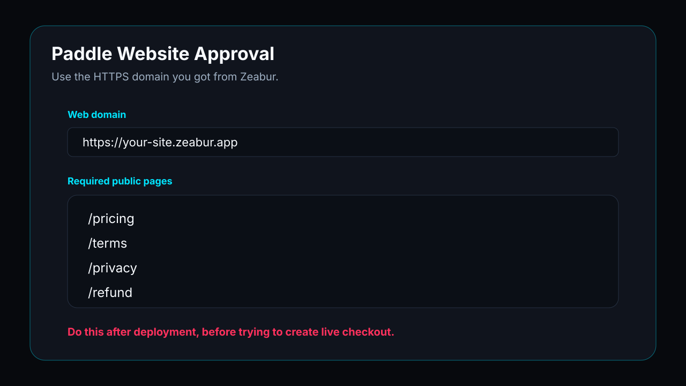
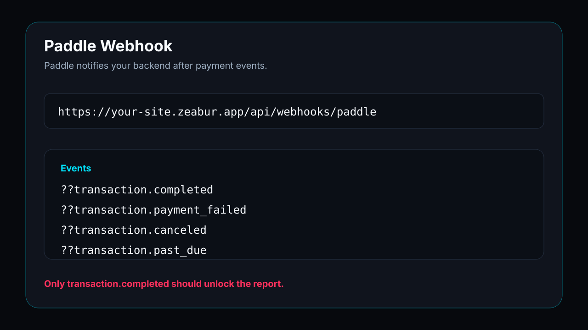

# 05. Paddle 결제와 자동 잠금 해제


**목표: Paddle 은 결제를 처리하고, 내 백엔드는 webhook 을 검증해 리포트를 해제합니다.**

## 흐름

```text
해제 버튼 -> payment session -> Paddle transaction checkout -> 결제 -> webhook -> 검증 -> access token -> 전체 리포트 표시
```

프론트엔드만으로 결제 성공을 판단하지 마세요. 신뢰할 수 있는 것은 webhook 입니다.

## 상품 설명

```text
We sell a one-time digital career assessment report. Users complete a quiz and receive a personalized online report. The product is digital content access, not employment placement, financial advice, medical advice, or guaranteed career outcome.
```

`Checkout has not yet been enabled` 가 나오면 onboarding, website approval, default payment link, product, price, 심사 상태를 먼저 확인합니다.

## Website approval



```text
Pricing: https://your-domain/pricing
Terms: https://your-domain/terms
Privacy: https://your-domain/privacy
Refund: https://your-domain/refund
```

## Product 와 Price


일회성 디지털 상품을 만들고 CNY 9.90, USD 1.99 one-time price 를 만듭니다. subscription 은 선택하지 않습니다.

## Webhook



URL:

```text
https://your-domain/api/webhooks/paddle
```

`transaction.completed` 에서만 잠금 해제합니다. `custom_data.payment_session_id` 와 `report_id` 가 백엔드 기록과 일치하는지도 확인해야 합니다.

## Zeabur Variables

```bash
PADDLE_ENVIRONMENT=sandbox
PADDLE_API_KEY=your_sandbox_api_key
PADDLE_CNY_PRICE_ID=pri_xxx
PADDLE_USD_PRICE_ID=pri_xxx
PADDLE_WEBHOOK_SECRET=your_webhook_secret
PADDLE_ALLOW_UNSIGNED_WEBHOOKS=false
```
